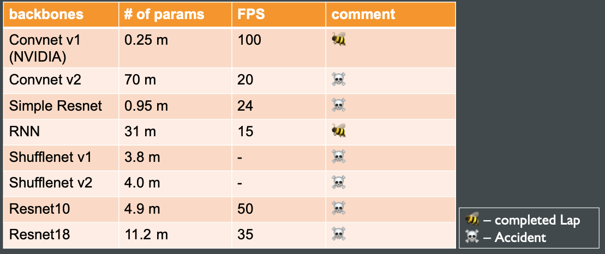

# 
Bumblebee 

## Prerequisites
* SVL Simulator - [Instructions here](https://www.svlsimulator.com/docs/installation-guide/installing-simulator/)
* Data Link - [Download from Drive](https://drive.google.com/file/d/1rL90epx_HgIjThv9ABoYMDS5SetPue1_/view?usp=sharing)  into maps folder
* Data Directory Structures - `./bumblebee/maps/Map1/data1/`

## Table of Contents
1. [Abstract](#abstract)
2. [Implementation](#implementation)
3. [Evaluation](#cvaluation)
4. [Conclusion](#conclusion)
5. [References](#references)

### Abstract
### Implementation
### Evaluation
* Results:

### Conclusion 
### References 
1. Bojarski, M.,Testa, D., Dworakowski, D., Firner, B., Flepp, B., Goyal, P., Jackel,
L., Monfort, M., Muller, U., Zhang, J., Zhang, X., Zhao, J., & Zieba, K. (2016). End to End Learning for Self-Driving Cars. ArXiv, abs/1604.07316.
2. [SVL simulator](www.svlsimulator.com)
3. [ROS](www.ros.org)
4. J. Zhou, X. Hong, F. Su and G. Zhao, "Recurrent Convolutional Neural Network Regression for Continuous Pain Intensity Estimation in Video," 2016 IEEE Conference on Computer Vision and Pattern Recognition Workshops (CVPRW), 2016, pp. 1535-1543, doi: 10.1109/CVPRW.2016.191.
5. Eraqi, H.M., Moustafa, M.N., & Honer, J. (2017). End-to-End Deep Learning for Steering Autonomous Vehicles Considering Temporal Dependencies. ArXiv, abs/1710.03804.
