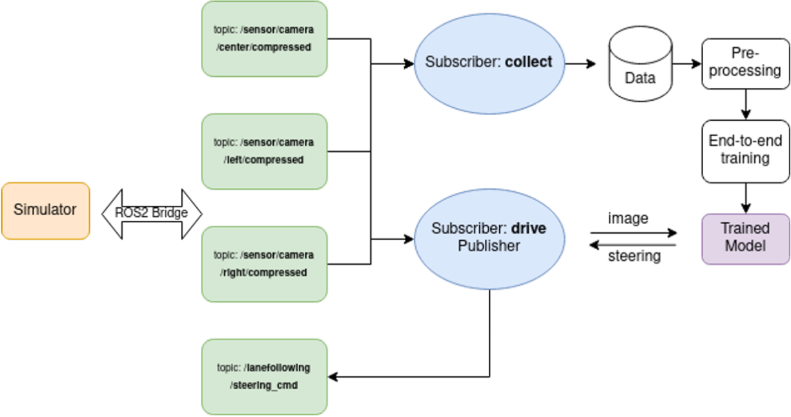
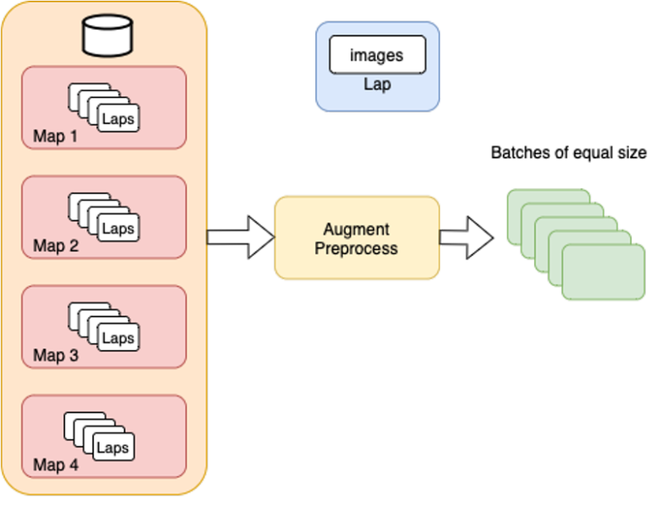
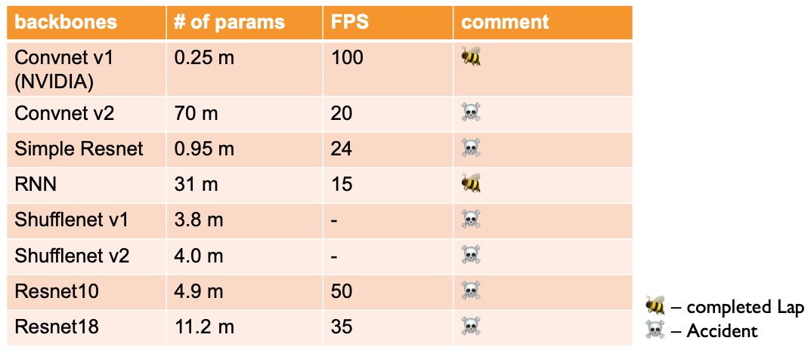

# 
Bumblebee 

## Prerequisites
* SVL Simulator - [Instructions here](https://www.svlsimulator.com/docs/installation-guide/installing-simulator/)
* Data Link - [Download from Drive](https://drive.google.com/file/d/1rL90epx_HgIjThv9ABoYMDS5SetPue1_/view?usp=sharing)  into maps folder
* Data Directory Structures - `./bumblebee/maps/Map1/data1/`

## Table of Contents
1. [Abstract](#abstract)
2. [Implementation](#implementation)
3. [Evaluation](#cvaluation)
4. [Conclusion](#conclusion)
5. [References](#references)

### Abstract
### Implementation
#### 1) End-to-end architecture

#### 2) Data Acquisition
* Map: 4 different maps: San Francisco, BorgesAve, Circular Path and Lan-less road
* Data: a. Camera feeds (left/right/center), b. corresponding steering angle values.
* Drive Speed: constant speed
* Time: 10+ hours of driving

#### 3) Data Preprocessing
* Data Augmentation
  * Data addition: flipping images and negating corresponding steering angles.
  * Histogram balanceing: randomly resampling to the mean to remove bias as below.
  * Cropping: removal irrelevant information (sky, hood, etc.)
  * Scaling: reducing resulution 
* Batching: to make the algorithms run within limited memory.

#### 3) Training 
* setting:
  * backbone: convnet from NVIDIA, 5 conv layers+ 4 dense layers.
  * GPU: GTX 1080 8GB
  * Optimizer: Adam
  * Learning rate: 10^-4
  * Epochs: 10
  * Batch size: 32 or 128
  * Callbacks: Early stopping
  * Number of parameters: 250k
  * Framework: Tensorflow==1.15, keras==2.3.1
  * CUDA: 10.1

* result of convenet backbone:
  * inference time: 10 ms
  * FPS: 100 FPS
  * Successfully completed laps on all maps.

#### 4) Network Exploration
To make networks adjusted to more complicated road conditions, we explored more backbones to compare (results can be found in next part.):
* Baseline: convnet from NVIDIA (from previous part)
* convnet v2: another version of convnet with more FC layers and less conv layer, thus more parameters.
* Simple Resnet: our own simplified resnet to make online inference possible.
* RNN: inspired by [Training a neural network with an image sequence — example with a video as input](https://medium.com/smileinnovation/training-neural-network-with-image-sequence-an-example-with-video-as-input-c3407f7a0b0f), implement a sliding window based LSTM network to consider long-time dependencies. In our implementation, we set the length of sequence to 5.
* Shufflenet v1: a classicial efficient feature extractor for mobile devices with channel shuffle module.
* Shufflenet v2: an improved version of Shufflenet v1.
* Resnet 10: widely used smaller Resnet.
* Resnet 18: the smallest resnet proposed by Kaiming He. 

### Evaluation
* **Results**:

### Conclusion 
### References 
1. Bojarski, M.,Testa, D., Dworakowski, D., Firner, B., Flepp, B., Goyal, P., Jackel,
L., Monfort, M., Muller, U., Zhang, J., Zhang, X., Zhao, J., & Zieba, K. (2016). End to End Learning for Self-Driving Cars. ArXiv, abs/1604.07316.
2. [SVL simulator](www.svlsimulator.com)
3. [ROS](www.ros.org)
4. J. Zhou, X. Hong, F. Su and G. Zhao, "Recurrent Convolutional Neural Network Regression for Continuous Pain Intensity Estimation in Video," 2016 IEEE Conference on Computer Vision and Pattern Recognition Workshops (CVPRW), 2016, pp. 1535-1543, doi: 10.1109/CVPRW.2016.191.
5. Eraqi, H.M., Moustafa, M.N., & Honer, J. (2017). End-to-End Deep Learning for Steering Autonomous Vehicles Considering Temporal Dependencies. ArXiv, abs/1710.03804.
