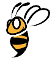

# 
Bumblebee 

## Team Members & Contributors
1. [Nitish Gupta](https://github.com/nitesh4146)
2. [Kameron Ted Bielawski](https://github.com/kambielawski)
3. [Xiangyu Chen](https://github.com/xiangyu8)
4. [Yiju Yang](https://github.com/YijuYang)
5. [Saharsh Gupta](https://github.com/saharshgupta)

## Prerequisites
* SVL Simulator - [Instructions here](https://www.svlsimulator.com/docs/installation-guide/installing-simulator/)

## Table of Contents
1. [Abstract](#abstract)
2. [Implementation](#implementation)
3. [Evaluation](#cvaluation)
4. [Conclusion](#conclusion)
5. [References](#references)

### Abstract
### Implementation
### Evaluation
### Conclusion 
### References 
